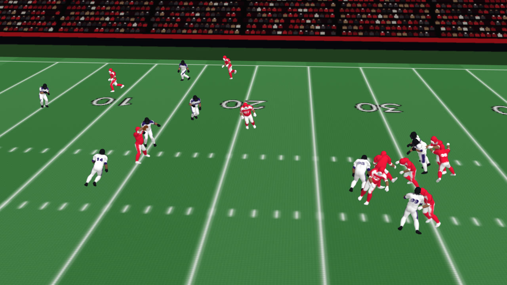

# PanopticPigskin

Two broadcast All-22 clips of one NFL play in; a 3D replay out. Both broadcast cameras are solved on every frame from
the field's own paint, every player is detected, tracked, joined across the two views and named by jersey, a full
SMPL-X body is fitted to what both cameras saw, placed on the turf, and rendered as Gaussian splats from any camera —
plus an interactive Film Room and a per-player report built from the tracking.

On the demo play (Ravens at Chiefs, 2024 week 1: Mahomes to Noah Gray, 9.7 yards) the reconstruction draws exactly
eleven players a side on every frame from the snap to the whistle.



## What is in here

| folder | what |
|---|---|
| `nfl_gsplat/` | the library: camera calibration from paint, tracking and cross-camera identity, pose fitting, placement, the timeline the renderer draws, the splat renderer, the rulers |
| `scripts/` | the pipeline's stages, numbered, and `pipeline_play.sh`, which runs them in order and resumes where it stopped |
| `tools/` | reading the film by hand: gridded crops, one id's boxes over time, drawn bodies projected back onto both films, and the helmet triangulation that places a man no camera can |
| `eval/` | the placement-surge ruler (the other rulers are `scripts/07l_measure_plausibility.py` and `scripts/09d_joint_rulers.py`) |
| `report/` | the demo play's per-player report, computed from the tracking |
| `viewer/` | the Film Room: the play in the browser from any seat, the two broadcast cameras, first person |
| `site/` | the static demo site (landing page, the Film Room, the report) |
| `plays/` | the demo play's hand-read inputs: ball events, the one film-read depth, the identity fixes |
| `tests/` | unit tests for the library and the stages |

## How it works

**Cameras.** Both cameras pan, tilt and zoom through the play. `08_reconstruct_all22.py` solves each one from the
paint — yard lines, hash marks, numerals — with the players' known height fixing the lens, which the paint alone
cannot; `08e` refines every frame, `08d` moves the solve into the rule-book field frame and checks it against the
play's line of scrimmage, and `08l` puts the endzone camera on its own paint.

**Players.** YOLOv8 finds every person in each camera; detections are linked into tracks on the turf
(`tracking.link3d`), cut where the kit changes for good (`08k`), read by jersey number (EasyOCR, `08c`) and paired
across the two cameras by number, kit and ankle rays (`08i`, `08r`/`08s`), with the endzone clip's frame offset
measured from the players who move (`05o`). Twin ids on one body are folded by their ankle rays (`08o`); ids that
switch men mid-track are cut (`08t`/`08u`). Where the tracker still slips inside a pile, the film decides: the tools in
`tools/film/` show who is who, and `08z`/`08za` fold or drop a camera track's rows.

**Pose.** YOLOv8x-pose finds 17 keypoints per player in both views (`05m`); a copy fine-tuned on the play's own
frames — pseudo-labelled from the first fit (`09g`), trained for thirty epochs (`09h`) — replaces it for the final
fits. Joints are triangulated from both cameras (`05n`) and a full SMPL-X body is fitted to them (`05f`) and to both
cameras' keypoints at once (`05p`); bodies only the endzone camera sees get a fit of their own (`05r`). SMPLest-X
(`05c`) supplies the initial poses.

**Placement.** Each player's feet are traced to the turf in both views. The sideline camera measures where a man
stands across its view but not how far away he is, so each body slides along its own sideline ray onto the endzone
camera's detection of him (`render.depth_snap`); the path is smoothed hardest along that blind axis and the feet are
anchored under the posed body. A man neither camera can place — feet hidden behind a blocker, never boxed from the end
zone — is placed by triangulating his helmet from both films (`tools/film_read_depth.py`, `<play>/film_reads.json`).

**Timeline.** `render.play_timeline` builds what is drawn: identities held through gaps, duplicates removed, a
running gait for fast legs and a foot-contact lock for slow ones, the throw, catch, carry and tackle from the ball's
events (`09a`, `08y`), and the clip cut where the play is dead (`08x`).

**Render.** `05k_render_hifi.py` turns each posed SMPL-X mesh into Gaussian splats in the kits the film shows, with
helmets, pads and numbers, lit by a stadium key light through each splat's normal, over a splat of the field (the
footage's own turf or a painted field) inside a bowl of seats — from a follow camera, a skycam, or either broadcast
camera's own solved pose.

## Results on the demo play

Measured on the timeline the renderer draws, over the live play (snap 395 to down 607, 213 frames at 59.94 fps) unless
stated:

| ruler | what it counts | value |
|---|---|---|
| census | \|Chiefs drawn − 11\| + \|Ravens drawn − 11\|, mean per frame | **0.00** (213 of 213 frames exactly 11 v 11; 390 of the clip's 401) |
| steps | a body moving more than 0.25 m between consecutive frames | **0** |
| hops | a step more than 0.15 m beyond its neighbours' median | **0** |
| surges | pelvis acceleration over 25 m/s², share of body-frames | **4.3 %** |
| joint jitter | second difference of pelvis-relative joints, m/frame², p50 / p90 | 0.016 / 0.059 |

`scripts/07l_measure_plausibility.py` prints the first four families; `eval/surge_ruler.py` the surges.
[docs/RULERS.md](docs/RULERS.md) says what each ruler reads and what a real player scores.

## Running it

See [SETUP.md](SETUP.md) for the two environments, the licence-gated body model and the model weights. Then, for a
play whose clips are at `data/all22/<game>/<play>/sideline.mp4` and `endzone.mp4`:

```bash
export PY_MAIN=/path/to/main-env/python PY_SMPLX=/path/to/smplx-env/python
bash scripts/pipeline_play.sh data/all22/<game>/<play> <play>/sideline.mp4 <play>/endzone.mp4 <los-yards> --from-paint
```

The header of `scripts/pipeline_play.sh` lists every stage. [plays/bal_at_kc_2024_wk1/play_001](plays/bal_at_kc_2024_wk1/play_001)
has the demo play's command line and hand-read inputs. The Film Room is `viewer/play_room.html` with the pipeline's
`play_joints.json` beside it (served over HTTP), deep-linkable: `?cam=pocket&frame=394`, `?cam=real:endzone`,
`?cam=fpv&id=80`.

## Limits

- **Piles** are the weakest part: bodies inside them are seen clearly by neither camera for long stretches, so their
  poses and, after the whistle, their depths are the least certain.
- **Modelled, not measured:** the running gait above 4.8 m/s, the throw, catch, carry and tackle poses, and where a
  player's head points.
- **By hand:** the ball's snap, passer and down frame, one film-read depth, and the identity fixes inside piles.

## License

PanopticPigskin is released under the GNU Affero General Public License v3.0 — see [LICENSE](LICENSE). The
third-party components below keep their own licences.

## Third-party components and data

- SMPL-X and SMPL body models: licence-gated, non-commercial research use; not included.
- Ultralytics YOLOv8 (detection, keypoints): AGPL-3.0.
- SMPLest-X (initial poses): see its repository's licence; not included.
- EasyOCR (jersey numbers): Apache-2.0.
- nflverse rosters: fetched at run time, not included.
- Broadcast footage: not included and not redistributed. The published renders use a painted field.
